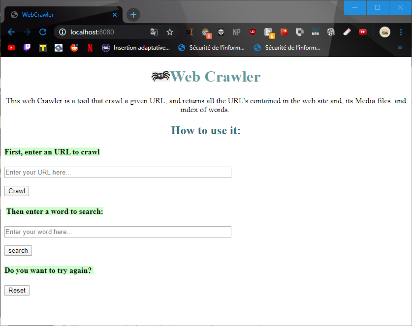

# Web Crawler :spider:


* This web Crawler is a tool that crawl a given URL following all the links it could find.
* It provides a web interface
* It returns all the pages contained in the site including its Media files.
* Once the URL crawled, allows the user to search for a keyword.
* Displays then, pages containing the entered keyword. 


#### Used Tech :computer:
------------

*  Eclipse [IDE] : used to build the project
*  Java  [Programming Language] : used to code almost the entire project  
*  Jsoup [HTML Parser] :  used to parse HTML pages
*  XML [Markup language] : used to save the crawling history in the machine where the server is used
*  HTML [Markup language] : used to make the HTML pages returned to client 
*  CSS [Style sheet language] : used make the HTML pages returned to client


#### Getting Started :rocket: 
------------


######  Prerequisites


- This program uses the [JSOUP](https://jsoup.org/ " JSOUP ") library to parse HTML pages. It is provided in the project file. To add it to your IDE, you have to add it on the build path 
If you run in on Eclipse IDE:

```sh
> right click the project > Build Path > Add External Archives > (select the Jsoup jar) > Open.  
```

------------

###### Before starting 

- This crawler considers that no matter what page of a site, it is always possible to reach the home page (at least by clicking on the site's logo). So, if we search two different pages of the same site, the same result will be returned. No need to search again. 

 For that we have to crawl the whole site (no link limit). 

 If you want to test with a limit of links to search: modify in the CrawlingThreads class the MAX_LINKS variable 

```java
private static final int MAX_LINKS = 20;

```
(but then, the hypothesis becomes obsolete and the results will not be accurate).

- The server is set to listen on port 8080, if it's already bind in you PC, just change the PORT variable in the WebThread Class

```java
static final int PORT = 8080; 
```
- The program is cleaned from useless console outputs, if you want to see crawling details, just uncomment the viewLists line below in the CrawlingThreads class:
```java
else if (key.isReadable()) {
readAnswer(key, urlList_toVisit, urlList_visited, urlList_current, index, urlList_unvalid, MediaFileList);
//viewLists(MediaFileList, urlList_unvalid, urlList_toVisit, urlList_visited, urlList_current);
```
- To test the multiuser feature, you have to run one user per browser, or launch a user in regular mode, and the other on incognito.

------------

###### Running

*  Here are the steps to launch the program: 
1. Run the App Class of the project
2. Open a Web browser (only working for google Chrome)
3. If running web client on same machine enter:

```
localhost:8080 (unless the port have been changed)

```

4. If different machines: (Make sure your firewall is not blocking the port from external connexions) 

```
[yourIpAdress]:8080 (unless the port have been changed)

```
5. Follow the instructions in the web Interface: 



6. If you want to try the crawling again with the same URl, delete the crawlingHistory.xml file from the project (refresh to see it)

------------


###### Possible problems

- For some URLs the path can be very (very...) long. a little bit (a lot...) of patience is required.
- If you wait too long between URL crawling and searching for a keyword, the URL's data will be lost and you have to enter the URL to crawl once again. 


------------

#### Bugs  :cry:

If any other bugs than listed below, please report them by mailing the authors

- If multiple users, none of them can search for a word until all the crawling finnished.
- The answer HTML files created are never deleted.
- If we search for different pages of the same site, and in the same time, both results will be written in
the reccord file, thats because, checking the file is done at the beginning of the crawling, while the result
is written in the .XML file is proccessed at the very end of the crawling.   

------------
#### Authors :woman: :woman:

* **Lilia TALBI**    - lilia.talbi@etu.u-pec.fr  
* **Naima BENAZZI** - 		 naima.benazzi@etu.u-pec.fr

------------
#### Acknowledgments :pray:

* Actually a lot of people in stackOverflow
* Voices (S. and N.) for mental support ... T.T 

------------

